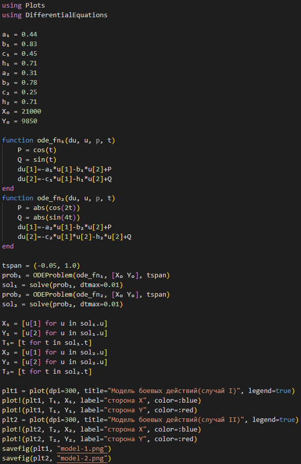

---
## Front matter
lang: ru-RU
title: Лабораторная работа № 3
author:
  - Покрас Илья Михайлович
group:
  - НФИбд-02-20, 1032200534
date: 2023, Москва

## i18n babel
babel-lang: russian
babel-otherlangs: english

## Formatting pdf
toc: false
toc-title: Содержание
slide_level: 2
aspectratio: 169
section-titles: true
theme: metropolis
header-includes:
 - \metroset{progressbar=frametitle,sectionpage=progressbar,numbering=fraction}
 - '\makeatletter'
 - '\beamer@ignorenonframefalse'
 - '\makeatother'
---

## Цели

- Построение модели боевых действий между регулярными войсками на языках Julia и OpenModelica
- Построение модели боевых действий с участием регулярных войск и партизанских отрядов на языках Julia и OpenModelica

## Ход работы

Код программы Julia(рис. @fig:001):

{#fig:001}

## Ход работы

Модель первого случая(рис. @fig:002):

.png){#fig:002}

## Ход работы

Модель второго случая(рис. @fig:003):

.png){#fig:003}

## Ход работы

Код первого случая OpenModelica(рис. @fig:004):

.png){#fig:004}

## Ход работы

Модель первого случая OpenModelica(рис. @fig:005):

.png){#fig:005}

## Ход работы

Код второго случая OpenModelica(рис. @fig:006):

.png){#fig:006}

## Ход работы

Модель второго случая OpenModelica(рис. @fig:007):

.png){#fig:007}

## Результаты

В ходе проделанно работы мы изучили модели Ланчестера для моделирования ведения боевых действий, а также построили математические модели на языке программирования Julia и OpenModelica