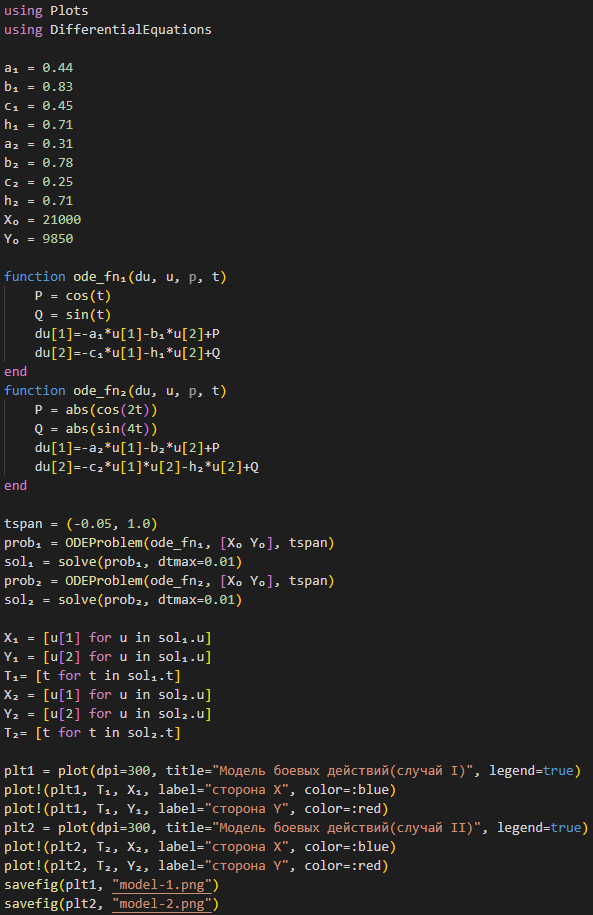

---
## Front matter
title: "Лабораторная работа № 3"
subtitle: "Модель боевых действий"
author: "Покрас Илья Михайлович"

## Generic otions
lang: ru-RU
toc-title: "Содержание"

## Bibliography
bibliography: bib/cite.bib
csl: pandoc/csl/gost-r-7-0-5-2008-numeric.csl

## Pdf output format
toc: true # Table of contents
toc-depth: 2
lof: true # List of figures
lot: false
fontsize: 12pt
linestretch: 1.5
papersize: a4
documentclass: scrreprt
## I18n polyglossia
polyglossia-lang:
  name: russian
  options:
	- spelling=modern
	- babelshorthands=true
polyglossia-otherlangs:
  name: english
## I18n babel
babel-lang: russian
babel-otherlangs: english
## Fonts
mainfont: PT Serif
romanfont: PT Serif
sansfont: PT Sans
monofont: PT Mono
mainfontoptions: Ligatures=TeX
romanfontoptions: Ligatures=TeX
sansfontoptions: Ligatures=TeX,Scale=MatchLowercase
monofontoptions: Scale=MatchLowercase,Scale=0.9
## Biblatex
biblatex: true
biblio-style: "gost-numeric"
biblatexoptions:
  - parentracker=true
  - backend=biber
  - hyperref=auto
  - language=auto
  - autolang=other*
  - citestyle=gost-numeric
## Pandoc-crossref LaTeX customization
figureTitle: "Рис."
tableTitle: "Таблица"
listingTitle: "Листинг"
lofTitle: "Список иллюстраций"
lotTitle: "Список таблиц"
lolTitle: "Листинги"
## Misc options
indent: true
header-includes:
  - \usepackage{indentfirst}
  - \usepackage{float} # keep figures where there are in the text
  - \floatplacement{figure}{H} # keep figures where there are in the text
---

# Цели работы

Построение математической модели боевых действий

# Задание

-Построить модель боевых действий между регулярный войсками;
-Построить модель ведения боевых действий с участием регулярных войск и партизанских отрядов.

# Теоретическое введение

Законы Ланчестера - это математические формулы для расчета относительной силы вооруженных сил . Уравнения Ланчестера - это дифференциальные уравнения, описывающие зависимость силы двух армий A и B от времени, причем функция зависит только от A и B.

# Выполнение лабораторной работы

Между страной $Х$ и страной $Y$ идет война. Численность состава войск исчисляется от начала войны, и являются временными функциями $x(t)$ и $y(t)$. В начальный момент времени страна $Х$ имеет армию численностью $21000$ человек, а в распоряжении страны $У$ армия численностью в $9850$ человек. Для упрощения модели считаем, что коэффициенты $a$, $b$, $c$, $h$ постоянны. Также считаем $P(t)$ и $Q(t)$ непрерывные функции.
Построим графики изменения численности войск армии $Х$ и армии $У$ для следующих случаев:

1. Модель боевых действий между регулярными войсками:
    
    $\frac{dx}{dt}=-0,44x(t)-0,83y(t)+cos(t)+1$

    $\frac{dx}{dt}=-0,45x(t)-0,71y(t)+sin(t)+1$

2. Модель ведение боевых действий с участием регулярных войск и партизанских отрядов:

    $\frac{dx}{dt}=-0,31x(t)-0,78y(t)+|cos(2t)|$

    $\frac{dx}{dt}=-0,25x(t)-0,71y(t)+|sin(4t)|$

Реализация построения математической модели на языка программирования Julia(рис. @fig:001):

{#fig:001}

Модель первого случая(рис. @fig:002):

.png){#fig:002}

Модель второго случая(рис. @fig:003):

.png){#fig:003}

Реализация построения математической модели для OpenModelica:

Код первого случая(рис. @fig:004):

.png){#fig:004}

Модель первого случая(рис. @fig:005):

.png){#fig:005}

Код второго случая(рис. @fig:006):

.png){#fig:006}

Модель второго случая(рис. @fig:007):

.png){#fig:007}

# Вывод
В ходе проделанно работы мы изучили модели Ланчестера для моделирования ведения боевых действий, а также построили математические модели на языке программирования Julia и OpenModelica

# Список литератры

[1] https://en.wikipedia.org/wiki/Lanchester%27s_laws

[2] https://openmodelica.org/doc/OpenModelicaUsersGuide/latest/
